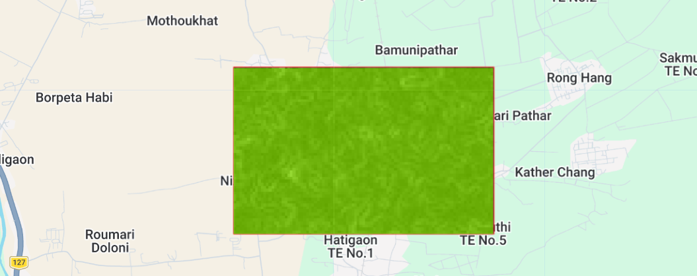
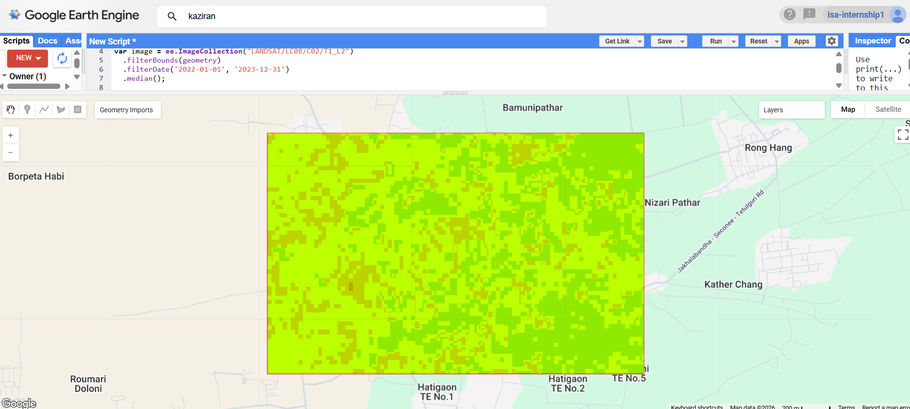

# 🐘 Habitat Suitability Mapping — Kaziranga National Park, Assam

GIS-based ecological suitability analysis for the region adjacent to Kaziranga National Park, combining NDVI-derived vegetation health and terrain slope to identify wildlife habitat zones using Google Earth Engine.


---

## 📍 Overview

| | |
|---|---|
| **Study Area** | Region adjacent to Kaziranga National Park, Assam, India |
| **Data Sources** | Landsat-8 (NDVI) + USGS SRTM (Slope) |
| **Time Period** | January 2022 – December 2023 |
| **Platform** | Google Earth Engine (JavaScript API) |
| **Resolution** | 30 m |
| **Type** | Internship Project — India Space Academy, Summer Training Program 2026 |

## 🎯 Objective

To identify and map suitable habitat zones for wildlife by integrating vegetation health (NDVI) and terrain slope through a GIS-based multi-criteria weighted overlay approach, supporting conservation planning in an ecologically sensitive landscape.

## 🗺️ Study Area

<p align="center">
  
</p>

AOI manually drawn over the grassland-forest mosaic adjacent to Kaziranga National Park, Assam, using the GEE drawing tool.

## ⚙️ Methodology

1. Defined Area of Interest (AOI) via GEE drawing tools
2. Loaded Landsat-8 Surface Reflectance imagery, filtered by bounds and date range
3. Computed NDVI: `(NIR − Red) / (NIR + Red)` using bands SR_B5, SR_B4
4. Loaded SRTM DEM and derived slope using `ee.Terrain.slope()`
5. Reclassified NDVI and slope into suitability scores (1 / 3 / 5 scale)
6. Combined reclassified layers via simple additive overlay to generate a Habitat Suitability Index
7. Classified index into Unsuitable / Moderately Suitable / Highly Suitable zones
8. Computed per-class area statistics using `pixelArea()` + grouped reduction

### Code

```javascript
Map.centerObject(geometry, 9);
Map.addLayer(geometry, {color: 'red'}, 'My Study Area');

var image = ee.ImageCollection("LANDSAT/LC08/C02/T1_L2")
  .filterBounds(geometry)
  .filterDate('2022-01-01', '2023-12-31')
  .median();

var ndvi = image.normalizedDifference(['SR_B5','SR_B4']).rename('NDVI');
Map.addLayer(ndvi.clip(geometry), {min:0, max:1, palette:['white','green']}, "NDVI");

var dem = ee.Image("USGS/SRTMGL1_003");
var slope = ee.Terrain.slope(dem);
Map.addLayer(slope.clip(geometry), {min:0, max:30}, "Slope");

var ndviClass = ndvi.expression("(b('NDVI') > 0.5) ? 5 : (b('NDVI') > 0.3) ? 3 : 1");
var slopeClass = slope.expression("(b('slope') < 5) ? 5 : (b('slope') < 15) ? 3 : 1");

var habitat = ndviClass.add(slopeClass).clip(geometry);
Map.addLayer(habitat, {min:2, max:8, palette:['red','yellow','green']}, 'Habitat Suitability');

var classified = habitat.gt(6).add(habitat.gt(4)).add(habitat.gte(0));

var areaImage = ee.Image.pixelArea().divide(1e6).addBands(classified);
var areaStats = areaImage.reduceRegion({
  reducer: ee.Reducer.sum().group({groupField: 1, groupName: 'class'}),
  geometry: geometry,
  scale: 30,
  maxPixels: 1e13
});
print('Area per habitat class (sq km):', areaStats);
```

## 📊 Results

<p align="center">
  
</p>

| Class | Area (sq. km) | % of Total |
|---|---:|---:|
| 🔴 Unsuitable | 0.65 | 14.1% |
| 🟡 Moderately Suitable | 2.54 | 55.2% |
| 🟢 Highly Suitable | 1.42 | 30.9% |
| **Total** | **4.61** | **100%** |

## 🔎 Key Findings

- Over 86% of the study area is classified as Moderately or Highly Suitable habitat, driven by dense vegetation cover and gentle terrain
- The dominance of favorable zones aligns with Kaziranga's status as a globally significant biodiversity landscape, home to the one-horned rhinoceros and numerous other species
- Only 14.1% of the area was classified as Unsuitable, corresponding to sparse-vegetation or comparatively steeper patches within the region

## ⚠️ Limitations

- The weighted overlay uses only two factors (NDVI, slope); results are sensitive to the classification thresholds chosen
- Additional variables — proximity to water bodies, land use/land cover, and validated wildlife occurrence records — would strengthen the reliability of the suitability map
- Landsat-8's 30 m resolution may not capture fine-scale habitat heterogeneity

## 📚 References

1. Kushwaha, S.P.S., Roy, P.S., Azeem, A., Boruah, P., & Lahon, P. (2000). Land area change and rhino habitat suitability analysis in Kaziranga National Park, Assam. *Tiger Paper*, XXVIII(2), 9–16.
2. Land Cover Change and Rhino Habitat Mapping of Kaziranga National Park, Assam — Habitat Suitability Model using AHP-based remote sensing and GIS techniques.
3. [Google Earth Engine Data Catalog — LANDSAT/LC08/C02/T1_L2](https://developers.google.com/earth-engine/datasets/catalog/LANDSAT_LC08_C02_T1_L2)
4. [USGS SRTM 1 Arc-Second Global](https://developers.google.com/earth-engine/datasets/catalog/USGS_SRTMGL1_003)

## 🛠️ Tech Stack

`Google Earth Engine` · `JavaScript` · `Landsat-8` · `SRTM DEM` · `Remote Sensing` · `GIS` · `Multi-Criteria Decision Analysis`

---

**Internship:** Summer Training Program 2026, India Space Academy — Department of Space Education
**Supervisor:** Miss. Alisha Sinha
**Author:** Pushkar Tyagi, Shivaji College, University of Delhi
